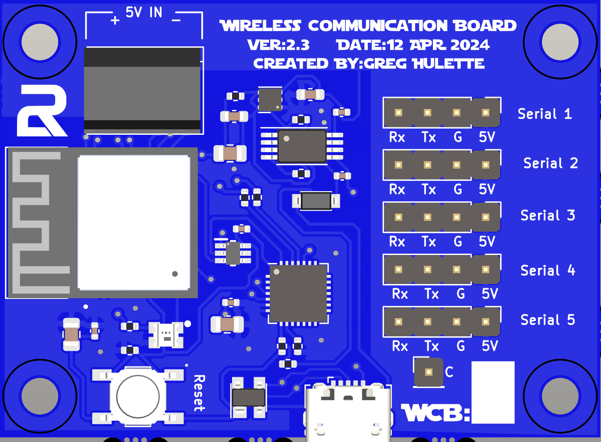
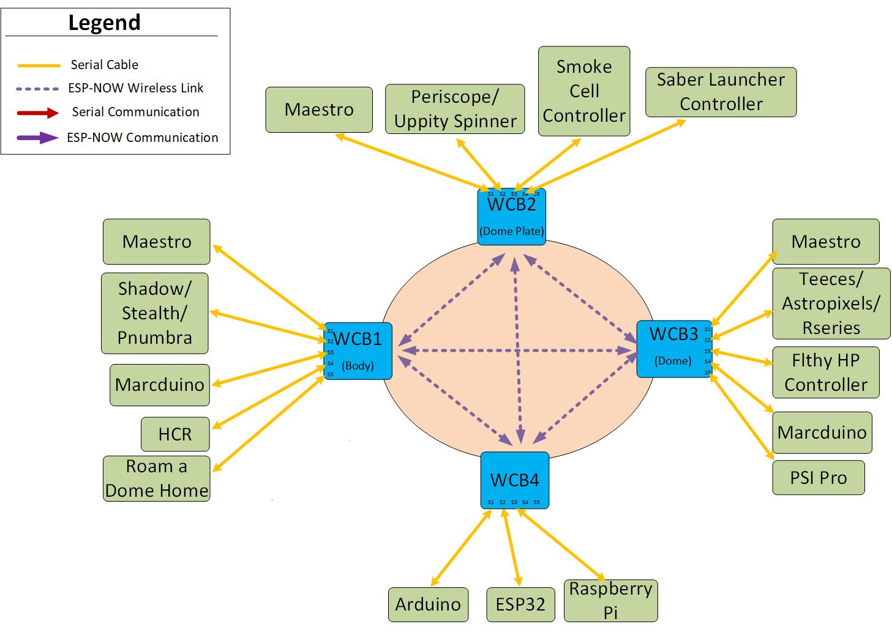
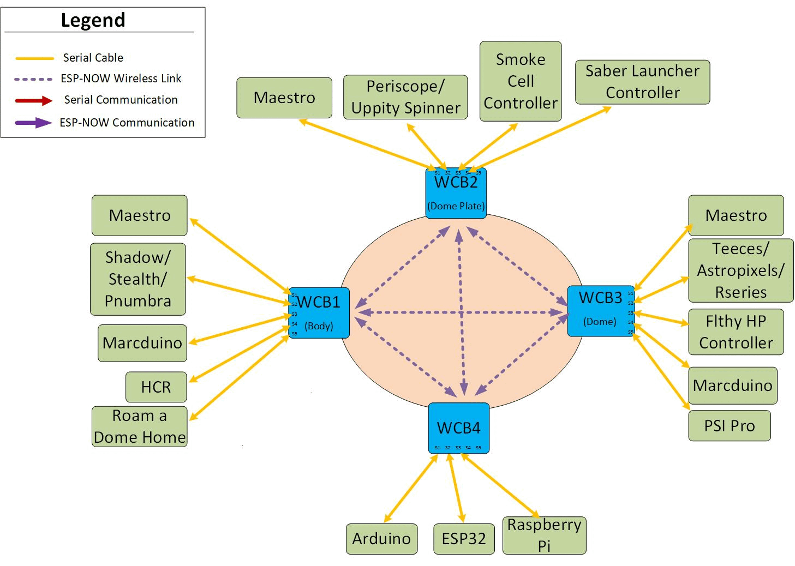
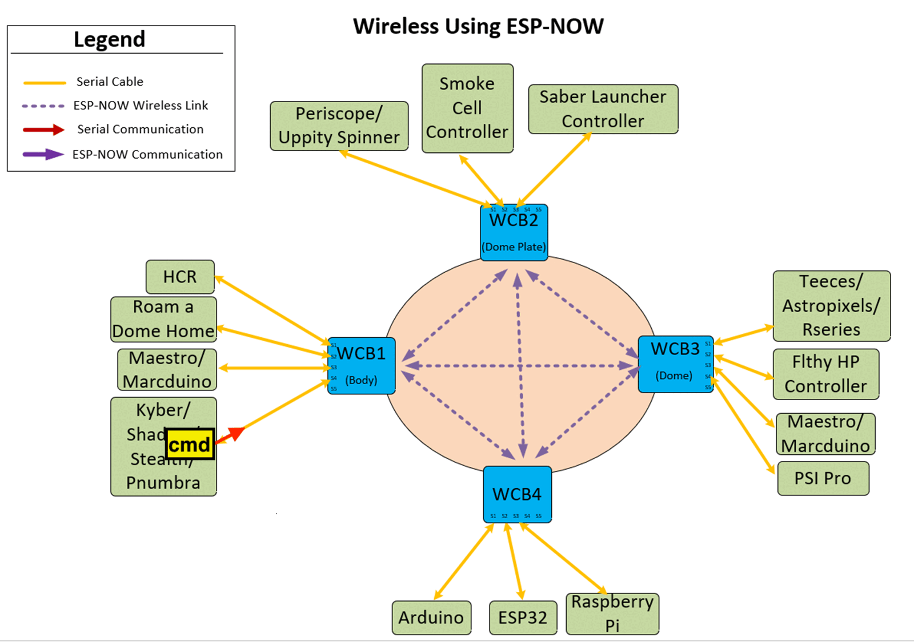
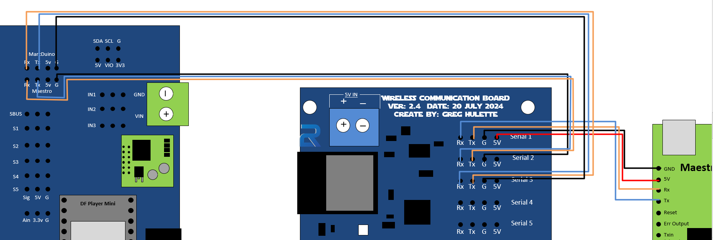
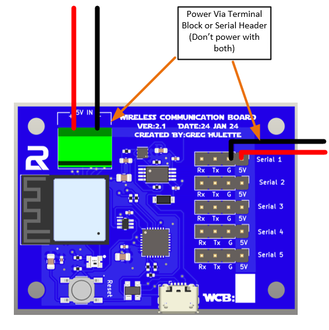
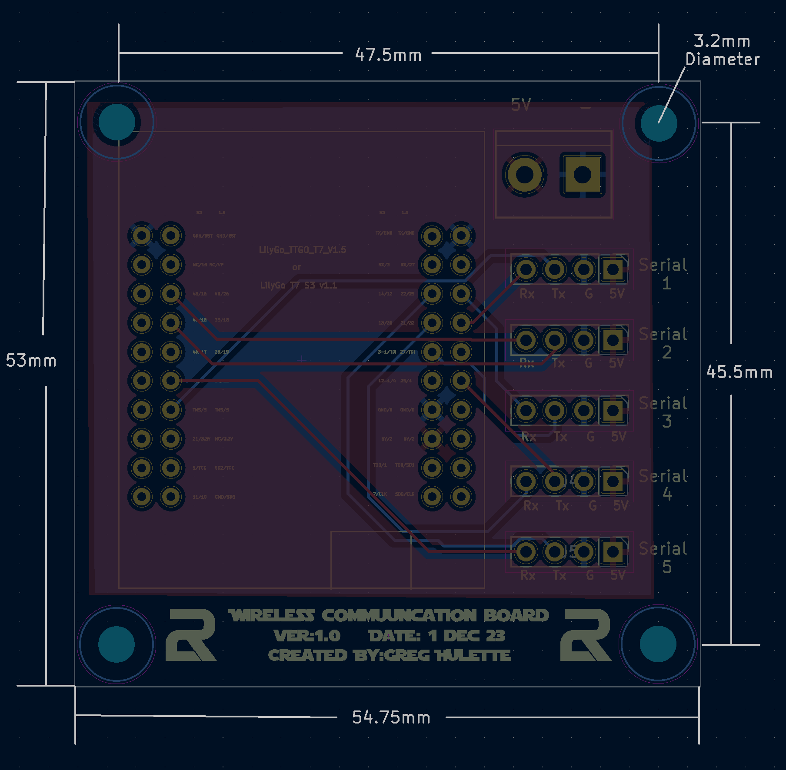
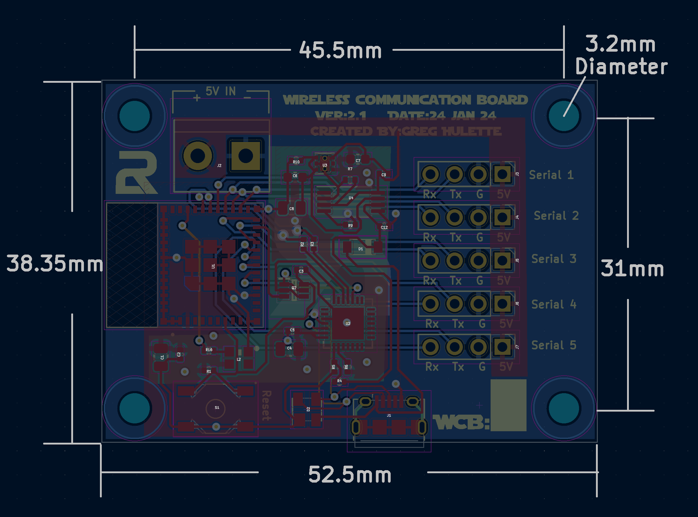

<h1 style="display:inline; height: 75px; font-size:51px;">Wireless Communication Board (WCB)</h1>


## **1. Introduction**

### **1.1 Overview**
<br>Background: <br>I was initially having issues getting signals into and out of the dome reliably and wanted a better way to accomplish this.  I started out with I2C like most builders but quickly found out that I2C wasn't meant for longer distances or electrically noisy environments.  I realized that serial communications are better in this type of environment, but wasn't sure how to get serial to the many different devices within my Droid since serial can only be connected to a single device at a time.  There is a way for connected device to replicate the signal out another port and implement serial IDs, but I didn't feel like that was the most efficient means of communication.   

<br>Hence, the reason I made these boards.  I developed these boards to allow the various microcontrollers in R2 to communicate out of their serial port directly to another board, no matter where they are in a droid.  I accomplished this by accepting a serial command into the WCB from a microcontroller, evaluating whether it will go out another locally connected serial port, or forward it to another WCB to send it out to one of their locally connected serial ports.  This is essentially how computer networks work as well.  
<br>I decided to go with a wireless technology between the WCBs to alleviate some of the issues with being in an electrically noisy environment as well as remove the need for passing data through the slip ring between the body and dome. The WCB's are using ESP-NOW, which is a connectionless wireless communication protocol that allows the quick and low-power control of smart devices without a router.  It uses the same frequencies that WiFi uses, but I have not seen any RF congestion issues that traditional WiFi sees at conventions.  By using this method, all you need in the dome is power and you can control the dome without it being physically connected to the body.  

While these boards don't control any components within R2, it does allow for the efficient communication of all other microcontrollers.  These boards also allow you to have multiple serially connected devices to communicate with each other directly and bi-directionally. The serially connected devices can communicate to other serial devices connected to the same WCB, or devices connected to remote WCBs. This is accomplished by adding up to 6 characters to your string that you send to the remote device.

### **1.2 Features**

- **ESP-NOW Communication**: Unicast and broadcast messaging across multiple WCB units.
- **Kyber Support**: Forward data between Serial1 and Serial2 with low latency to support Kyber/Maestro Communication.
- **FreeRTOS Multi-Tasking**: Optimized for efficient parallel processing.
- **Dynamic Configuration**: Adjust all configurable settings via command.  Examples are baud rates, stored commands, WCB Number, WCB Quantity, ....
- **Persistent Storage**: Save and retrieve settings using NVS (Non-Volatile Storage). These settings are stored in NVS which persists after reboot and even after reloading of the sketch.  
- **Store Command Sequences in NVS**: Store your command sequences in the WCB instead of your controller.  200 character limit per stored command.

- **ESP-NOW Communication**: Unicast and broadcast messaging across multiple WCBs.
- **Serial Communicatons**: Bi-Directional Unicast and Broadcast messages to its 5 Serial ports
- **Kyber Support**: Forward data between Serial1 and Serial2 with low latency to support Kyber/Maestro Communication.
- **Dynamic Configuration**: Adjust baud rates, stored commands, and all WCB settings via commands.
- **Persistent Storage for Settings and Commands**: Save and retrieve settings using NVS (Non-Volatile Storage).  Store your command sequences in the WCB instead of your controller.  200 character limit per stored command.  These settings are stored in NVS which persists after reboot and even after reloading of the sketch. 

### **1.3 Physical Board Versions**

#### **1.3.1 HW Version 1.0**


CAD Image       |    Actual Image       | Bare PCB |
:---------------:|:---------------------:|:-------------:|
 | | |

Features of the board:
- LilyGo T7 Mini32 V1.5
- 5V Terminal Block
- 5 Serial ports that can be used to communicate with microcontrollers  
- Up to 8 WCB's can be used at once in a fully meshed network
- Communication can be individual (Unicast), or be broadcasted to all devices at once.
- Can support bi-directional communications<br>

***  PLEASE NOTE THE DIRECTION OF THE ESP32 WHEN PLUGGING IT INTO THE PCB ON VERSION 1.0. ***

*** THE MICRO USB PORT SHOULD BE ON THE SIDE WITH THE LABEL.  YOU MAY DESTROY YOUR ESP32 IF PLUGGED IN THE WRONG DIRECTION ***

#### **1.3.2 HW Version 2.1**

CAD Image       |    Actual Image     |
:---------------:|:---------------------:|
<br>||
 


 Features of the board:
- Integrated ESP32-PICO-MINI-02
- 5V Terminal Block
- 5 Serial ports that can be used to communicate with microcontrollers  
- Up to 8 WCB's can be used at once in a fully meshed network
- Communication can be individual (Unicast), or be broadcasted to all devices at once.
- Can support bi-directional communications

#### **1.3.3 HW Version 2.3/2.4**

CAD Image       |    Actual Image     
:---------------:|:---------------------:
<br>|
 


 Features of the board:
- Integrated ESP32-PICO-MINI-02
- 5V Terminal Block
- 5 Serial ports that can be used to communicate with microcontrollers  
- Up to 8 WCB's can be used at once in a fully meshed network
- Communication can be individual (Unicast), or be broadcasted to all devices at once.
- Can support bi-directional communications

HW Versions 1.0 and 2.1/2.3/2.4 are physically different, but have the same capabilities and are operated the exact same way.  They are 100% interoperable with each other and can be mixed in the same network.  All WCBs must be running the same version of Software though to ensure they are interoperable.

### **1.4 Concept of Operations**
Below, you will see some possible connections that can exist to the WCB's.  In the picture, there are only 4 WCBs, but the system can handle up to 8 of them.  Each one of the microcontrollers, represented by a green box, can communicate directly with any other microcontroller, regardless if they are physically connected to the same WCB.  I can envision most people using 2 or 3 WCBs.  One in the body, one in the dome, and one on the dome-plate.

<br>
<br>


<br>

Now if we lay the different types of communications over this picture, you can see how the boards can send the various types of messages.  The animation is showing how different messages are handled by the WCBs.  
<br><br>


<br>

As you can see in the above image, you can send any other board a direct message. This is what I'm calling a Unicast message.  
<br>
With this method, your controller would send each command separately and the WCB will process them as they come in.  There is an option to chain the commands together so your controller only has to send one command.  You would separate each of the individual commands with the ^ character.  The WCB will separate the commands when it receives it.  Below is an example
<br><br>

With this method, your controller would send each command separately and the WCB will process them as they come in.  There is an option to chain the commands together so your controller only has to send one command.  You would separate each of the individual commands with the ^ character.  The WCB will separate the commands when it receives it.  Below is an example


<br>
You can see the commands in the previous example are chained together and now the controller is sending that long string of commands to the WCB.  
<br>

If you want to or have a limitation on the length of command you can send to the WCB, you are able to store that chained command on the WCB.  Below is an example on how that transmission would look.  
<br>



<br>
The WCBs can also Broadcast messages.  The thought is that you send a command everywhere, and if the receiving device accepts the command, it acts on it.  Otherwise it would ignore the command.  The GIF below shows the broadcast messages.  
<br><br> <br><br> 


The Wireless Communication Board (WCB) is a versatile communication system designed to facilitate **ESP-NOW** wireless communication between multiple ESP32-based devices. The system also provides **serial bridging**, command processing, and dynamic configuration for a variety of use cases.

## **2. Command Reference**

### **2.1 Command Refence Intro**
I have broken the command structure down into 2 categories.  One of them is to control the board itself, and the other is to execute commands that transfer the data.  The local commands start with the "?" and the execution commands start with ";". These can be changed as needed via a command

### **2.2 Local Function Commands (**`?COMMANDS`**)**

| **Command**        | **Description**                      |
| :------------------| --------------------------------   |
| `?CONFIG`          | Display current configuration settings.       |
| `?DON`             | Enable debugging mode                         |
| `?DOFF`            | Disable debugging mode.                    |
| `?CSkey,value`     | Store a command with a key-val, separate the name and the stored command with a comma.  You have commas in the command and it will not affect the storing of the commands.|
| `?CCLEAR`          | Clear all stored commands | 
| `?CEkey`           | Clear a specific stored command with the key name given | 
| `?WCBx`            | Set the WCB number (1-8).|
| `?WCBQx`           | Set the total number of WCBs in the system MUST match on all boards in system |
| `?WCB_ERASE`       | Erase all WCB stored settings.  |
| `?M2xx`            | Set the 2nd MAC Octet (hex)  0x00 - 0xFE   \*\*\*MUST match on all boards in system   |
| `?M3xx`            | Set the 3rd MAC octet (hex).   0x00 - 0x FE  \*\*\*MUST match on all boards in system  |
| `?Sx0/1`           | Enable/Disable broadcast for Serial x. 0 for disabled, 1 for enabled|
| `?SxBAUDRATE`      | Set baud rate for Serial x. |
| `?EPASSxxxx`       | Update ESP-NOW password.  \*\*\*MUST match on all boards in system |
| `?REBOOT`          | Reboot the WCB |
| `?MAESTRO_ENABLE`  | Enable Maestro communication |
| `?KYBER_LOCAL`     | Enable Kyber communication locally. |
| `?KYBER_REMOTE`    | Enable Kyber communication remotely. |
| `?KYBER_CLEAR`     | Clear Kyber settings. |
| `?HWx`             | Set the hardware version.   \*\*\*\* MUST set hardware version to use the system. |

### **2.3 Command Character-Based Commands (**`;COMMANDS`**)**

These will be the majority of what you will use to interact with the WCB on a normal basis.  These are not case sensitive, so feel free to use upper or lower case characters.

| **Command**  | **Description**  |
| ------------ | -------------------------------- |
| `;Sxyyy`     | Send a message to Serial x (1-5) with the message of yyy. |
| `;Wxyyy` | Send a unicast message to WCB x. with the message of yyy      |
| `;Ckey`      | Recall a stored command by key.                           |
| `;Mxyy`      | Send a Maestro command (x = Maestro ID, yy = sequence). 1-8 valid Maestro IDs.  0 = send to all Maestros.  ID's must match WCB number they are plugged into. |

### **2.4 Syntax for Commands**

#### **2.4.1 WCB to WCB->Serial Communication**
```
;W(x);S(y)(zzzzz....)

x: 1-8 : Target WCB's number.  If sending to WCB2, enter 2
y: 1-5 : Target's Serial Port, if sending to Serial 1 on target board, enter 1
zzzz.... : String to send to end device
```
Examples
```
;W3;S4:PP100  : This would send the string ":PP100" to WCB3, and out its Serial 4 port
;W2;S2#SD0    : This would send the string "#SD0" to WCB2, and out its Serial 2 port
```

#### **2.4.2 Serial Communications Command Syntax**
```
;S(y)(zzzzz....)

y: 1-5 : Target's Serial Port, if sending to Serial 1 on target board, enter 1
zzzz.... : String to send to end device
```
Examples
```
;S4:PP100  : This would send the string ":PP100" out its local Serial 4 port
;S2#SD0    : This would send the string "#SD0" out its local Serial 2 port
```

#### **2.4.3 Chaining Commands:**
You can chain commands together and have the WCB process those commands one after another.  You can do this by adding a "^" in between different commands in the string.

Example:<br>

 ```   
;W3;S4:PP100^;W3;S2#SD0^;W3;S1:PDA180
```

The command would take that string and break it into 3 different commands and process them immediately.  There is only a few millisecond delay between each command.
```
1. ;W3;S4:PP100
2. ;W3;S2#SD0
3. ;W3;S1:PDA180
```

The delimiter is ^ by default, but also can be changed.

I have tested the following characters (& * . - / ) but do not see why others wouldn't work as well.


## **3. Loading and Configuring the WCB**
**All WCBs are configured prior to shipping, but if you want to upgrade an existing WCB or setup a new one, follow these steps.**

### **Required Drivers**

To recognize the WCB on your computer, ensure you have the correct driver installed gpt versions 2.x and higher:

- **CP2102N Driver** (Required for many ESP32 boards)

  - Download: [Silicon Labs CP2102N Driver](https://www.silabs.com/developers/usb-to-uart-bridge-vcp-drivers)


### **Required Libraries**

Before compiling the firmware, install the following libraries in the Arduino IDE:


- **EspSoftwareSerial** (For software-based serial communication) By : Dirk Kaar and Peter Lerup, Version tested 8.1.0: 

- **Adafruit NeoPixel** (For controlling LED status indicators) By: Adafruit, Version tested: 1.12.4

### **3.1 Firmware Installation**

1. Install **Arduino IDE** and required ESP32 libraries.  ESP32 board version 3.1
2. Install libraries mentioned above.
3. Clone the WCB firmware repository.
4. Open the `WCB.ino` file found in the Code folder.
5. Compile and upload the firmware to your ESP32 board, selecting "ESP Dev Module" as your board type.
6. Open the serial monitor to verify successful setup. You will have to hit the reset button on the WCB to show that it booted up after a reload.

### **3.2 Setting Up the WCB System**

To ensure proper communication between multiple WCB devices, follow these setup steps:

#### **Step 1: Set the Hardware Version**

Each WCB must be configured with the correct hardware version before use. 

**NOTHING WILL WORK WITHOUT PERFORMING THIS STEP!!!!**

Use the following command:

```
?HWx  (Replace x with the hardware version number: `1` for Version 1.0, `21` for Version 2.1, `23` for Version 2.3, `24` for Version 2.4)
```

Examples:

```
?HW1  // Set WCB to hardware version 1.0
or 
?HW24  // Set WCB to hardware version 2.4
```

#### **Step 2: Set the WCB Number**

Each WCB must have a unique identifier between 1-8. Use the following command:

```
?WCBx  (Replace x with the WCB number)
```

Example:

```
?WCB2  // Set this WCB as WCB 2
```

#### **Step 3: Set the WCB Quantity**

The total number of WCBs in the system must be set and must match on all devices.

```
?WCBQx  (Replace x with the total number of WCBs in the system)
```

Example:

```
?WCBQ3  // There are 3 WCBs in the system
```

#### **Step 4: Configure the ESP-NOW Password**

All WCBs must use the same ESP-NOW password to communicate.

```
?EPASSxxxxxxx
```

Example:

```
?EPASSsecure123  // Set the ESP-NOW password to 'secure123'
```

#### **Step 5: Set the MAC Addresses**

To prevent interference between different WCB systems, all devices in the same system must have the same MAC octets, and be different than other WCB systems.  This is accomplished by changing the 2nd and 3rd octet of the MAC address.  All WCBs will have the 1st, 4th, 5th, and 6th octets match, but the 2nd and 3rd must be unique.  The MAC Address should be 

```
02:xx:yy:00:00:0w
``` 
where the xx is the second octet that you set, the yy is the 3rd octet that you set, and the w, the WCB number.  The w is automatically set when you identified the WCB number.  You set the 2nd and 3rd octets with the following commands:

```
?M2xx  // Set the 2nd MAC octet
?M3xx  // Set the 3rd MAC octet
```

Example:

```
?M222  // Set 2nd MAC octet to 0x22
?M333  // Set 3rd MAC octet to 0x33
```

The valid characters that can be used are 0-9, and A-F.  Do not use FF though because that would introduce a possible interference with other systems.

#### **3.2.1 Example Setup for a 3-WCB System:**

| **WCB Unit** | **Command**       | **Value**          |
| ------------ | ----------------- | ------------------ |
| WCB1         | `?HW1`            | Version 1.0        |
|              | `?WCB1`           | Unit 1             |
|              | `?WCBQ3`          | 3 WCBs total       |
|              | `?EPASSsecure123` | ESP-NOW password   |
|              | `?M222`           | MAC Octet 2 = 0x22 |
|              | `?M333`           | MAC Octet 3 = 0x33 |
| WCB2         | `?HW21`           | Version 2.1        |
|              | `?WCB2`           | Unit 2             |
|              | `?WCBQ3`          | 3 WCBs total       |
|              | `?EPASSsecure123` | ESP-NOW password   |
|              | `?M222`           | MAC Octet 2 = 0x22 |
|              | `?M333`           | MAC Octet 3 = 0x33 |
| WCB3         | `?HW24            | Version    2.4     |
|              | `?WCB3`           | Unit 3             |
|              | `?WCBQ3`          | 3 WCBs total       |
|              | `?EPASSsecure123` | ESP-NOW password   |
|              | `?M222`           | MAC Octet 2 = 0x22 |
|              | `?M333`           | MAC Octet 3 = 0x33 |

All WCBs must have **matching** `WCBQ`, `EPASS`, `M2`, and `M3` values to communicate properly.  The WCBs HW versions do not need to match.  They are all completely interoperable with one another.

Once configured, reboot each WCB with:

```
?REBOOT
```
The rebooting is critical since a lot of these settings are set up at boot, and not after.

<br>
You don't have to enter these commands one at a time if you don't want to.  You can chain all these commands using the command delimiter and reboot at the end:

Example:
```
?HW1^?WCB1^?WCBQ3^?EPASSsecure123^?M222^?M333^?REBOOT
```


## **4. Features Overview/Details**

### **4.1 Serial Communication**

- Supports **Unicast** (Single Serial Port Communcations) and **Broadcast** (All Configured Serial Ports Communicatoin). 
- If you don't specify a Serial Port, your message will automatically be broadcasted.  
- The baud rate can be changed via commands.  All serial ports are set to 9600 by default.
- You an choose to allow each serial port to be part of the broadcasts or not.  This will ensure messages are not getting sent to boards that don't want them.  You will have to send commands to these boards directly via unicast messages.  Broadcasts are enabled by default for all ports.
- If you don't specify a Serial Port, your message will automatically be broadcasted to all ports with broadcast enabled. 

### **4.2 ESP-NOW Communication**

- Supports **Unicast** (WCB-to-WCB) and **Broadcast** (WCB group-wide).
- Automatically ignores messages from unrelated groups (different MAC octets and passwords) for security.
- If you don't specify a WCB#, your message will automatically be broadcasted to all WCBs.  

### **4.3 Kyber Support**

The WCB supports the Kyber with both the serial commands, via its MarcDuino port, and the Maestro control via its Maestro port.  The WCB supports the serial commands by default, but there is specific configuration you need to enable in the WCB to enable Maestro communication between the Kyber and Maestro.  

The WCBs have two modes for Kyber support,  **Kyber Local** and **Kyber Remote**. The local mode is for when the Kyber is plugged directly into the WCB along with a Maestro, and the remote mode is when only the maestro is plugged into the WCB but triggered by the Kyber remotely.  

 Connections: 
 - The Maestro must be plugged into Serial 1 
 - The Kyber's Maestro port must be plugged into Serial 2.  
 - The Kyber's MarcDuino port can be plugged into any of the remaining serial ports.  

To enable Kyber Local Mode, use the command `?kyber_local`.  To enable the Kyber Remote mode, use `?kyber_remote`. You should not run both of these modes on the same WCB.  You will be notified which mode you are running during the boot message


Here is a simple wiring diagram to show how it would be connected.


<br>I know it's a little hard to see, so here's a little closer view of the wiring.  




Please note that the Tx from the Kyber goes to the Rx of the WCB, and the Rx of the Kyber goes to the Tx of the WCB


 **NOTE:** Kyber is not supported in the Serial only mode.  You must be using the ESPNOW to enable this functionality.

### **4.4 Maestro Support without Kyber**
If you don't have Kyber, but still use the Maestro, you can still trigger sequences with the WCB.  You do not have to utilize the Pololu Maestro Library to accomplish this if you are using the WCBs.  
All you have to do is send the command `;Mxyy` to the WCB, where x is the ID of the Maestro, and yy is the sequence that you want to start. 

Connections/Requirements:
- Maestros must be plugged into Serial 1.  
- Only 1 Maestro is supported per WCB.
- Maestro ID must match the WCB number that it is plugged into (i.e. Maestro ID of 2 plugged into WCB2, Maestro ID of 3 plugged into WCB3)
- Can have up to 8 Maestros when controlling them this way.
- You can broadcast to all Maestros by using the Maestro ID of 0.  This will trigger all Maestros with the Sequence ID that is given.  

**Note:** Maestro comms is not supported in the Serial only mode.  You must be using the ESPNOW to enable this functionality. 

**NOTE:** Only the Restart Sequence is supported when utilizing the Maestros in this method.  It does not return status or have the ability to do servo passthrough at this time.

### **4.5 Stored Commands**

You can  store commands in the WCB's memory and recall them later.  This is accomplished by saving the commands in NVS (Non-Volatile Storage).  There are 2 parts of the stored commands.  The <i>**Key**</i>, and the <i>**Command**</i>.  The Key is used to identify the command being stored.  The Key can be anything you want with the characters of A-Z and 0-9.  The command can be any string of characters you would normally send the WCB.  The command can include delimeters, so mutlitple commands can be issued at once from the WCB. 

**Example**
Now that you understand what the key and command do, lets go through how to use them.  You store commands by using the `?CS` command.  The CS stands for Command Store.  The format to store a key/command is `?CSkey,command`.  You would enter the `?CS`, then the key, followed by a comma, then the command.  This comma is only read once so that if you need to store a comma in your command, it will allow that.  So lets save the command of `;m11` to the WCB.  

`?CSwave,;m11`

This saves the command `;m11` with the key of `wave`

Now that the key/command is saved into the WCB, you would call that with the:

 `;cwave`

 If you wanted to store a more complex command to wave and to play a sound, you may want to do somehting like this

 `?CSWaveAndSound,;m11^;S5<SH1,M1>`

 Now when you issue the command of `;cWandAndSound`, you start the sequence with the ID of 1 on Maestro 1, and play a sound on the HCR that's connected to Serial port 5 of WCB1.

 You can also have comments in your chain commands.  If you use the 3 stars *** you can add a command to your chain commands.

 ```
 ?cstest,;W2:S2A006^***All Holos to Rainbow^;m02^***All Maestros Seq 2
 ```
 and if you issue a ```?config``` you will see this
 ```
   Key: 'test' -> Value: ';W2:S2A006^***All Holos to Rainbow^;m02^***All Maestros Seq 2'
```
#### **4.5.1 Stored Command Example**

For this example, I'm going to assume that there is a Maestro connected to Serial 1 on WCB1 and that the Stealth is connected to Serial 2.  That Maestro has an ID of 1 and has a script with a sequence ID of 1 that triggers a wave function.  


In WCB1, you would issue the command `?CSwave,;m11`.  This saves the command `;m11` with a key of `wave` into the WCB memory and called when it receives `;cwave` command.  Now in the stealth, in the aux string 16, you would put `a=;cwave`.  This is shown in the above on the last line in the config example.  Now you have a more clear understanding what is being called with that aux string.  

I go into more details of the stored commands below in section x.x

### ** 4.6 Stealth Users**
The Stealth users should note that the Stealth uses the character ":" to break up a string when it's executing a function with a string. Myself and many builders also use the ":" in their command syntax and this can cause a complication.  There is an easy solution that can be implemented on the Stealth to combat this.  All you will need to do is change the delimiter that it uses to break up its string.  Add this line towards the top of your config.txt file to accomplish this.

<br>

```
auxdelim=&
```

You can change the `&` to another character if that interferes with something in your system.  If you are only using the stored commands specfied below, you may not need to change this auxdelim.  

Other than that change, you can set up the Stealth's config.txt file to send out strings via the serial command like normal.  

Examples to add to Stealth config.txt: 
```
b=3,5,1
g=454,5,2

a=;W3;S1:PP100
a=;W2;S2:SE00
```
The b=3,5,1 assigns button 3's action to send a string out the serial port, designated by the 5 in the command, and to send the first string, designated by the 1 in the command. The 1st string in this example is `;W3;S1:PP100`

The g=454,5,2 assigns the gesture 454(left twice) to send a string out the serial port, and to send the 2nd string.  The string in this example is ";W2;S2:SE00<br>

This is a more comprehensive list of gestures and buttons as an example:

```
b=1,5,13
b=2,5,14
b=3,5,15
b=4,5,16
b=6,1,12
b=7,1,5
b=8,1,6
b=9,1,2
g=4,5,1
g=6,5,2
g=2,5,3
g=8,5,4
g=454,5,5
g=656,5,6
g=252,5,7
g=858,5,8
g=45454,5,9
g=65656,5,10
g=25252,5,11
a=;W2;S1:PP100
a=;W2;S1:PH
a=;W2;S1:PS1
a=;W2;S1:PS2
a=;W2;S1:PS4
a=;W2;S2:SE00
a=;W2;S1:SE00
a=;W2;S1:SE01
a=;W2;S1:SE02
a=;W2;S1:SE03
a=;W2;S1:PS1
a=;S1:PS2
a=;S1:PS3
a=;S1:PDA0
a=;W3;S3:PDA0
a=;cwave
```

In this example, button 3 would make the Stealth send the string `;W3;S3:PDA0` out it's serial port.  The WCB would accept that command and forward the string ":PDA0" out the WCB3's Serial 3 port. <br>

This would be a perfect opportunity  to use the stored commands.  You can specify what you want to run in the WCB, then in the Stealth, you just call that sequence. 

## **5.0 Power**
 The WCB accepts only 5V power input.  The WCB can be powered by 2 different ways.  The screw terminal block, or the 5V pins on the serial port.  I do not recommend powering the board with both at the same time. <br>
 
 Note:  The 5V pins on the serial header are not connected to the USB 5V output.  The 5V pins are only connected to the 5V terminal block.  What this means for you is that if you power another device with the 5V pin in the serial header, you can not power that external board via the USB power.  You must power the WCB via the 5V terminal block to power an external board.  It is ok to have both the USB and 5V terminal supplying power to the board at the same time.  There is on board protection and the board will prefer the 5V source over the USB power. <br><br>

V1.0      |    V2.x+     
:---------------:|:---------------------:
<br>|
 


## **6.0 Dimensions**

Here are the dimensions for the boards.  With these dimensions, you can plan you setup or make a custom mount for your boards.

V1.0      |    V2.1+    
:---------------:|:---------------------:
<br>|
 

<br><br>

## **7. Troubleshooting & Debugging**

### **Erasing Flash & Resetting WCB to Factory Defaults**

If you need to completely erase the flash memory and reset the WCB to factory defaults, follow these steps using the Arduino IDE:

1. **Open Arduino IDE** and go to **Tools → Board → Select your ESP32 board**.
2. **Set the Flash Erase Mode:**
   - Go to **Tools → Erase All Flash Before Sketch Upload**.
   - Select **"Enabled"** to erase everything before uploading a new sketch.
3. **Upload the WCB firmware** after enabling flash erase.
4. **Reconfigure the WCB** using the setup commands in Section 2.

This will completely wipe the stored settings, including MAC addresses, ESP-NOW passwords, and stored commands, allowing you to start fresh.  You should "Disable" the erasing of flash before upload to prevent from having to reconfigure the WCB every time you load the sketch onto it.


| **Issue**                     | **Possible Solution**                                              |
| ----------------------------- | ------------------------------------------------------------------ |
| No response from WCB          | Verify power and USB connection. Check baud rate settings.         |
| ESP-NOW messages not received | Ensure correct MAC octets and ESP-NOW password.                    |
| Serial bridging not working   | Confirm correct pin configuration and baud rates.                  |
| Stored commands not executing | Use `?CONFIG` to check saved commands. Ensure key is correct. |
| Command not being sent         | Try issuing the command you are sending to the WCB in the IDE's Serial Monitor to see if there is an issue with the communication between the WCB, or the incoming serial port.|


## **7. Appendices**

### **7.1 Technical Specifications**

- **ESP32-based board compatibility**
- **Uses WiFi in station mode for ESP-NOW**
- **Supports up to 8 WCB devices in a network**

### **7.2 Pin Maps**

Refer to `wcb_pin_map.h` for pin configurations based on hardware version.

### **7.3 Additional Resour**[ces](https://github.com/espressif/arduino-esp32)

- [ESP-NOW Documentation](https://github.com/espressif/arduino-esp32)
- [Arduino ESP32 Core](https://github.com/espressif/arduino-esp32)
- [Pololu Maestro Documentation](https://www.pololu.com/docs/0J40)


## **8.0 Ordering**
If you are an astromech user, head over to this thread to order a set.

[Astromech.net Forum Post](https://astromech.net/forums/showthread.php?44271-Wireless-Communication-Boards-(WCB)-Continuous-23-JAN-2024&p=581076#post581076)


## 
This guide provides a complete reference for configuring and using the **Wireless Communication Board (WCB) system**. 🚀

