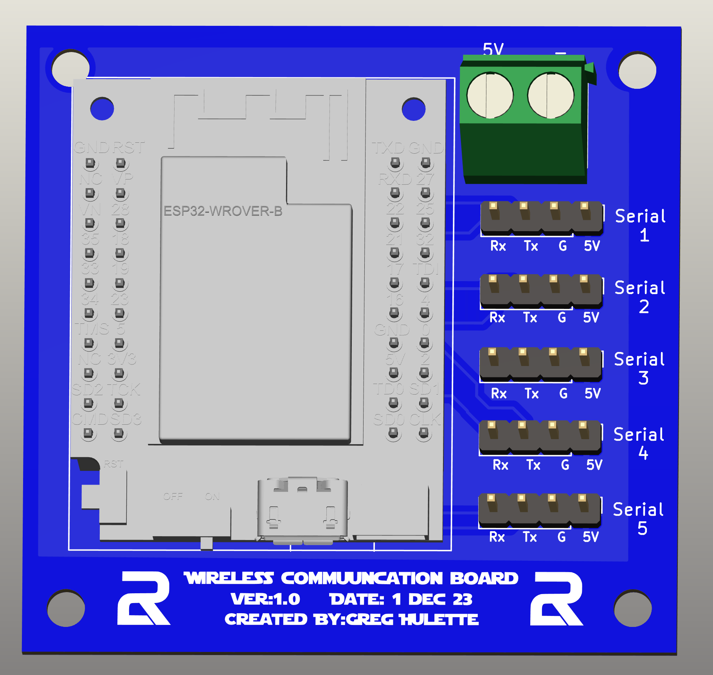
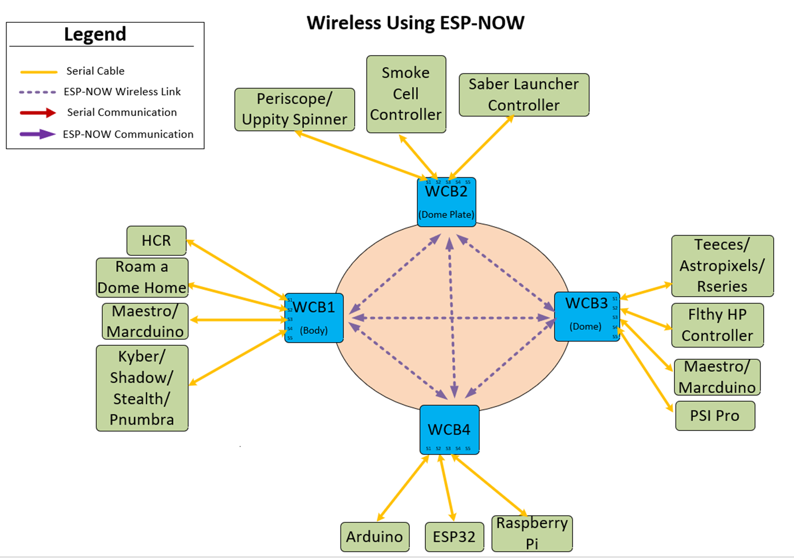
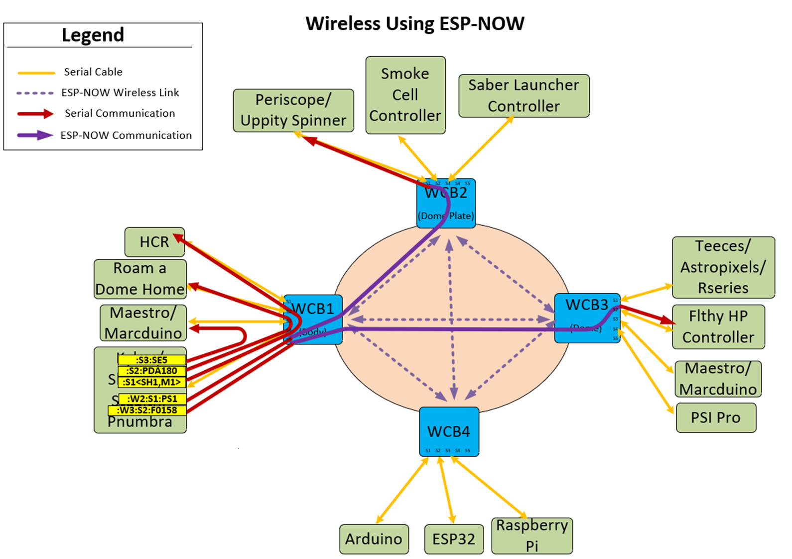

<h1 style="display:; font-size:50px;">Wireless Communication Boards (WCB)</h1>

<h2> Description/Purpose </h2>
I developed these boards to allow the various microcontrollers in R2 to communicate wirelessly.  I was initially having issues getting signals into and out of the dome reliably and wanted a better way to accomplish this.  These boards also allow you to have multiple serially connected devices to communicate with each other bi-directionaly. The serially connected devices can communicate to other serial devices connected to the same WCB, or devices connected to remote WCBs. This is accomplished by adding up to 6 characters to your string that you send to the remote device.  

 The wireless technology is using ESP-NOW for it's trasnmissioni protocol.  ESP-NOW is a connectionless wireless communication protocol that allows the quick and low-power control of smart devices without a router.  It uses the same frequencies that WiFi uses, but I have not seen any RF congestion issues that traditional WiFi sees at conventions.  

<h2>Board Overview</h2>
  

 Features of the board: 
- LilyGo T7 Mini32 V1.5
- 5V Terminal Block
- 5 Serial ports that can be used to commuincate with microcontrollers  
    - Serial 3-5 baud rate should be below 57600, but recommend 9600 for more reliable link.
- Up to 9 WCB's can be used at once in a fully meshed network
- Communication can be individual (Unicast), or be broadcasted to all devices at once.
- Can support bi-directional communications  

Below, you will see some possible connections that can exist to the WCB's.  In the picture, there are only 4 WCBs, but the system can handle up to 9 of them.  Each one of the microcontrollers, represented by a green box, can communicate directly with any other microcontroller, irregardless if they are physically connected to the same WCB.  I can envision most people using 2 or 3 WCBs.  One in the body, one on the domeplate, and one in the dome.

 
 

 Now if we lay the different types of communications over this picture, you can see how the boards can send the various types of messages.

<h2>Command Syntax</h2>
I have broken the command structure down into 2 categories.  One of them is to control the board itself, and the other is to execute commands that transfer the data.  The local commands start with the "#" and the execution commands start with ":".   

The thought was that with only adding 4 characters to your string you send out of your microcontroller, you can send 

 

The following lists out possible commands for local use. 

  

#L01  -  Displays the local hostname.  Useful to identify which board you are looking at in the serial monitor

#L02  -  Restarts the ESP32

#DESPNOW  - Toggles the ESPNOW debugging to allow you to debug ESPNOW related functions

#DSERIAL  -  Toggles the serial debugging to allow you to debug serial related functions

#DLOOP   -  Toggles the loop debugging to allow you to debug the main loop

#S(x)(yyyy) - Allows you to change the baud rate of a serial port.  Persists after reboot.
 - x: 1-5 : Serial port 1-5
- yyyy: any valid baud rate that the IDE can be set at.  

 
The following is the syntax for sending commands

Wireless Communication Command Sytax

:W(x):S(y)(zzzzz....)
     - x: 1-9 : Target WCB's number.  If sending to WCB2, enter 2
     - y: 1-5 : Target's Serial Port, if sending to Serial 1 on target board, enter 1
     - zzzz.... : String to send to end device

    Examples
    - :W3:S4:PP100  : This would send the string ":PP100" to WCB3, and out it's Serial 4 port
    - :W2:S2#SD0    : This would send the string "#SD0" to WCB2, and out it's Serial 2 port

Serial Communications Command Syntax

:S(y)(zzzzz....)
     - y: 1-5 : Target's Serial Port, if sending to Serial 1 on target board, enter 1
     - zzzz.... : String to send to end device

    Examples
    - :S4:PP100  : This would send the string ":PP100" to WCB3, and out it's Serial 4 port
    - :S2#SD0    : This would send the string "#SD0" to WCB2, and out it's Serial 2 port

<h2>Stealth Users</h2>
The Stealth users should note that the Stealth uses the charachter ":" to break up a string when it's executing a function with a string. Myself and many builders also use the ":" in their command syntax and this can cause an complication.  There is an easy solution that can be implemented on the Stealth to combat this.  All you will need to do is change the delimeter that it uses to break up it's string.  Add this line to the config.txt file to accomplish this.

 

    auxdelim=;

You can change the ";" to another character if that interferes with something in your system.

Other than that change, you can setup the Stealth's config.txt file to send out strings via the serial command like normal.  

    Examples to add to Stealth config.txt: 
    b=3,5,1
    g=454,5,2

    a=:W2:S3:PP100
    a=:W2:S2#SD0

The b=3,5,1 assigns button 3 send out the serial port, designated by the 5, and to send the first string, shown as the first a=xxxxx.

The g=454,5,2 assigns the gesture 454 to send out the serial port, and to send the 2nd string 

This is a more comprehensive list of gestures and buttons as an example:

    b=1,5,13
    b=2,5,14
    b=3,5,15
    b=4,5,16
    b=6,1,12
    b=7,1,5
    b=8,1,6
    b=9,1,2
    g=4,5,1
    g=6,5,2
    g=2,5,3
    g=8,5,4
    g=454,5,5
    g=656,5,6
    g=252,5,7
    g=858,5,8
    g=45454,5,9
    g=65656,5,10
    g=25252,5,11
    a=:W2:S1:PP100
    a=:W2:S1:PH
    a=:W2:S1:PS1
    a=:W2:S1:PS2
    a=:W2:S1:PS4
    a=:W2:S2:SE00
    a=:W2:S1:SE00
    a=:W2:S1:SE01
    a=:W2:S1:SE02
    a=:W2:S1:SE03
    a=:W2:S1:PS1
    a=:S1:PS2
    a=:S1:PS3
    a=:S1:PDA0
    a=:W3:S3:PDA0
    a=:W3:S5:LM052
  
