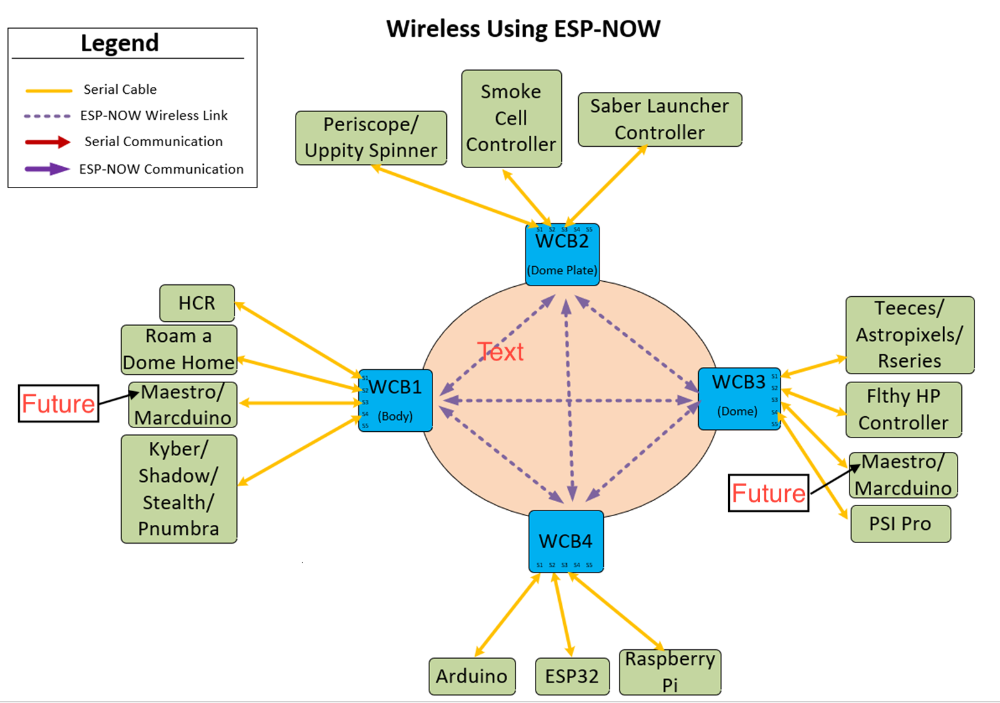
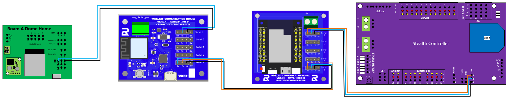

<h1 style="display:inline; height: 75px; font-size:51px;">Wireless Communication Board (WCB)</h1>

## Description/Purpose

 Background:  I was initially having issues getting signals into and out of the dome reliably and wanted a better way to accomplish this.  I started out with I2C like most builders but quickly found out that I2C wasn't meant for longer distances or electrically noisy environments.  I realized that serial communications are better in this type of environment, but wasn't sure how to get serial to the many different devices within my Droid since serial can only be connected to a single device at a time.  The connected device can replicate the signal out another port, but I didn't feel like that was the most efficient means of communication.   

 Hence, the reason I made these boards.  I developed these boards to allow the various microcontrollers in R2 to communicate out their serial port directly to another board, no matter where they are in my droid.  I accomplished this by accepting a serial command into the WCB from a microcontroller, evaluating whether it will go out another locally connected serial port, or forward it to another WCB to send it out to their locally connected serial port.  This is essentially how computer networks work as well.  
 I decided to go with a wireless technology between the WCBs to alleviate some of the issues with being in an electrically noisy environment as well as remove the need for passing data through the slip ring between the body and dome. The WCB is using ESP-NOW, which is a connectionless wireless communication protocol that allows the quick and low-power control of smart devices without a router.  It uses the same frequencies that WiFi uses, but I have not seen any RF congestion issues that traditional WiFi sees at conventions.  By using this method, all you need in the dome is power and you can control the dome without it being physically connected to the body.  

While these boards don't control any components within R2, it does allow for the efficient communication of all other microcontrollers.  These boards also allow you to have multiple serially connected devices to communicate with each other directly and bi-directionally. The serially connected devices can communicate to other serial devices connected to the same WCB, or devices connected to remote WCBs. This is accomplished by adding up to 6 characters to your string that you send to the remote device.  

## Board Overview

### HW Version 1.0

<!-- &emsp;&emsp;&emsp;Cad Image&emsp;&emsp;&emsp;&emsp;&emsp;&emsp;&emsp;&emsp;&emsp;&emsp;&emsp;&emsp;&emsp;&emsp;Actual Image&emsp;&emsp;&emsp;&emsp;&emsp;&emsp;&emsp;&emsp;&emsp;&emsp;&emsp;&emsp;Bare PCB 

 
&emsp;
&emsp;

  -->

CAD Image       |    Actual Image       | Bare PCB
:---------------:|:---------------------:|:-------------:
 | | 

 Features of the board:

HW Version 1.0
- LilyGo T7 Mini32 V1.5
- 5V Terminal Block
- 5 Serial ports that can be used to communicate with microcontrollers  
- Up to 9 WCB's can be used at once in a fully meshed network
- Communication can be individual (Unicast), or be broadcasted to all devices at once.
- Can support bi-directional communications 

***  PLEASE NOTE THE DIRECTION OF THE ESP32 WHEN PLUGGING IT INTO THE PCB ON VERSION 1.0. ***

*** THE MICRO USB PORT SHOULD BE ON THE SIDE WITH THE LABEL.  YOU MAY DESTROY YOUR ESP32 IF PLUGGED IN THE WRONG DIRECTION ***

  
### HW Version 2.1

CAD Image       |    Actual Image     
:---------------:|:---------------------:
 |
 

 Features of the board:
- Integrated ESP32-PICO-MINI-02
- 5V Terminal Block
- 5 Serial ports that can be used to communicate with microcontrollers  
- Up to 9 WCB's can be used at once in a fully meshed network
- Communication can be individual (Unicast), or be broadcasted to all devices at once.
- Can support bi-directional communications  

HW Versions 1.0 and 2.1 are physically different, but have the same capabilities and are operated the exact same way.  They are 100% interoperable with each other and can be mixed in the same network.  

## Concept of Operations
Below, you will see some possible connections that can exist to the WCB's.  In the picture, there are only 4 WCBs, but the system can handle up to 9 of them.  Each one of the microcontrollers, represented by a green box, can communicate directly with any other microcontroller, regardless if they are physically connected to the same WCB.  I can envision most people using 2 or 3 WCBs.  One in the body, one in the dome, and one on the dome-plate.

 
 

 Now if we lay the different types of communications over this picture, you can see how the boards can send the various types of messages.  The green microcontrollers are some examples of the boards that can communicate over serial and can be hooked up to this system.

As you can see in the above image, you can send any other board a direct message.        

---
## Command Syntax
I have broken the command structure down into 2 categories.  One of them is to control the board itself, and the other is to execute commands that transfer the data.  The local commands start with the "#" and the execution commands start with ":".   

 

The following lists out possible commands for local use. 

  

    #L01  -  Displays the local hostname.  Useful to identify which board you are looking at in the serial monitor
    #L02  -  Restarts the ESP32
    #L03  -  Displays ESP-NOW statistics

    #DESPNOW  - Toggles the ESPNOW debugging to allow you to debug ESPNOW related functions
    #DSERIAL  - Toggles the serial debugging to allow you to debug serial related functions
    #DLOOP   -  Toggles the loop debugging to allow you to debug the main loop

    #S(x)(yyyy) - Allows you to change the baud rate of a serial port.  Persists after reboot.
        x: 1-5 : Serial port 1-5
        yyyy: any valid baud rate that the IDE can be set at.  
    #SC   - Clears all stored baud rates.  Will revert to the rates defined in the sketch.

    #E(xxxx)  - Allows you to change the ESP-NOW password
    #ECLEAR   - Clears the stored ESP-NOW password and reverts to the password defined in the sketch

    #Q(y)     - Allows you to change the WCB quantity
    #Q0        - Clears the stored WCB quantity and reverts to the value stored in the sketch.

 
The following is the syntax for sending commands

### Wireless Communication Command Syntax

    :W(x):S(y)(zzzzz....)
    
    x: 1-9 : Target WCB's number.  If sending to WCB2, enter 2
    y: 1-5 : Target's Serial Port, if sending to Serial 1 on target board, enter 1
    zzzz.... : String to send to end device

    Examples
    :W3:S4:PP100  : This would send the string ":PP100" to WCB3, and out it's Serial 4 port
    :W2:S2#SD0    : This would send the string "#SD0" to WCB2, and out it's Serial 2 port

### Serial Communications Command Syntax

    :S(y)(zzzzz....)

    y: 1-5 : Target's Serial Port, if sending to Serial 1 on target board, enter 1
    zzzz.... : String to send to end device

    Examples
    :S4:PP100  : This would send the string ":PP100" to WCB3, and out it's Serial 4 port
    :S2#SD0    : This would send the string "#SD0" to WCB2, and out it's Serial 2 port

### Chaining Commands:
You can chain commands together and have the WCB process those commands one after another.  You can do this by adding a "*" in between different commands in the string.

Example: 
    
    :W3:S4:PP100*:W3:S2#SD0*:W3:S1:PDA180

The command would take that string and break it into 3 different commands and process them immediately.  There is only a few millisecond delay between each command.
1. :W3:S4:PP100
2. :W3:S2#SD0
3. :W3:S1:PDA180

There can be a maximum of 10 chained commands by default, but this can be changed in the sketch in the WCB_Preferences.h tab.

The delimiter is * by default, but also can be changed in the sketch.

Change the * to another character to change the delimiter.  I have tested the following characters (& * ^ . - ) but do not see why others won't work as well.

 

## Stealth Users
The Stealth users should note that the Stealth uses the character ":" to break up a string when it's executing a function with a string. Myself and many builders also use the ":" in their command syntax and this can cause a complication.  There is an easy solution that can be implemented on the Stealth to combat this.  All you will need to do is change the delimiter that it uses to break up its string.  Add this line towards the top of your config.txt file to accomplish this.

 

    auxdelim=;

You can change the ";" to another character if that interferes with something in your system.

Other than that change, you can set up the Stealth's config.txt file to send out strings via the serial command like normal.  

    Examples to add to Stealth config.txt: 
    b=3,5,1
    g=454,5,2

    a=:W3:S1:PP100
    a=:W2:S2:SE00

The b=3,5,1 assigns button 3's action to send a string out the serial port, designated by the 5 in the command, and to send the first string, designated by the 1 in the command. The 1st string in this example is ":W3:S1:PP100"

The g=454,5,2 assigns the gesture 454(left twice) to send a string out the serial port, and to send the 2nd string.  The string in this example is ":W2:S2:SE00 

This is a more comprehensive list of gestures and buttons as an example:

    b=1,5,13
    b=2,5,14
    b=3,5,15
    b=4,5,16
    b=6,1,12
    b=7,1,5
    b=8,1,6
    b=9,1,2
    g=4,5,1
    g=6,5,2
    g=2,5,3
    g=8,5,4
    g=454,5,5
    g=656,5,6
    g=252,5,7
    g=858,5,8
    g=45454,5,9
    g=65656,5,10
    g=25252,5,11
    a=:W2:S1:PP100
    a=:W2:S1:PH
    a=:W2:S1:PS1
    a=:W2:S1:PS2
    a=:W2:S1:PS4
    a=:W2:S2:SE00
    a=:W2:S1:SE00
    a=:W2:S1:SE01
    a=:W2:S1:SE02
    a=:W2:S1:SE03
    a=:W2:S1:PS1
    a=:S1:PS2
    a=:S1:PS3
    a=:S1:PDA0
    a=:W3:S3:PDA0
    a=:W3:S5:LM052
  

In this example, button 7 would make the Stealth send the string ":W2:S1:PS4" out it's serial port.  The WCB would accept that command and forward the string ":PS4" out the WCB2's Serial 1 port.       

----
## Code Preferences/Changes Needed
There are a few things that should be changed in the code when updating it.  There is a separate tab on the top of the sketch that has all those items.  
 NOTE: These items are populated with values in the default sketch so it will work if you don't change them, but you risk someone else sending your droid commands if another builder has this system and also does not change them.  <em><strong>I highly recommend you change these items.</strong></em>   

 

There are some things to change to the code before uploading to the WCB.    

1. Uncomment out the HW Version of board that you are using.  Only have 1 board uncommented at a time
2. Uncomment out the WCB Number board that you are loading this sketch onto.  Only have 1 board uncommented at a time
3. Serial Baud Rate of each of your serial ports.  This is only valid if you did not change
    your baud rate from the command line.  Once it is changed via the command (#Sxyyyy), 
    the correct value is shown on bootup and the value in this code is no longer accurate.  
    The value stored in the ESP32 will persist even after you upload the code again and 
    changing this value will not affect the baud rate stored in the ESP32.

******** (MUST MATCH ON ALL BOARDS)*********
1. Change the quantity of WCB's you are using in your setup
2. Change the ESPNOW password. This should be unique to your droid and prevents others with the same system from sending your droid commands if they didn't change their password.  (There is a 40 character limit on the password)
3. Change the umac_oct2 variable.  This represents the second octet of the MacAddress that the ESP-NOW protocol uses.  By changing this, you ensure that your WCB's will not communicate with other WCBs since they will not know each other's MAC address.  
4. Change the umac_oct3 variable.  This represents the third octet of the MacAddress that the ESP-NOW protocol uses.  By changing this, you ensure that your WCB's will not communicate with other WCBs since they will not know each others MAC address. Adding this octet to the uniqueness of the MAC address give more chances that there will not be another droid with your same mac address. 
5. Optionally change the max number of chained commands 
6. Optionally change the delimiter to be the same across all boards 

As the code specifies, Serial 3 Serial 5 should have a baud rate lower than 57600.  These serial ports are using software serial and are more reliable at the slower speeds.  I personally run he baud-rate of 9600 on them whenever I use them.  
   
## Loading the sketches onto the WCB

All the boards will come loaded with unique preferences as listed above to ensure you won't interfere with other users, but if you want to configure them for yourselves, please follow these steps to create your own set of files for your board with your own saved preferences. If you are adding more WCB's into your system at a later date, you can obtain all the necessary values to input into your code by watching your current WCBs boot up.
 

 In the code folder, you will only see the WCB1 folder.  This is the starting point for all the other boards.  I could have put up 9 folders, but then you would have to change the preferences in all 9 files, and could create a problem if some items don't match exactly.  This method should avoid that problem.  

1. Download the Repository to your computer by selecting the pulldown arrow in the green "Code" button on the top of this page, then select "Download Zip".  
2. Unzip the file
3. Open Code Folder, then WCB1 Folder, then the WCB1.ino file.
4. Edit the sketch preferences as mentioned above and save the file.
5. Copy the WCB1 Folder and rename it to WCB2, or WCB3, ...
6. Rename the WCB1.ino file in the newly copied folder to match the folder number.
7. Open the WCBx.ino file.
8. Comment out "#define WCB1" by adding "//" to the beginning of the line.
9. Uncomment out the WCB number that you are loading the sketch onto.  Only 1 WCBx should be uncommented in a single sketch.  WCB2's code should look like this. 

       // Uncomment only the board that you are loading this sketch onto. 
        // #define WCB1 
        #define WCB2 
        // #define WCB3 
        // #define WCB4 
        // #define WCB5 
        // #define WCB6 
        // #define WCB7 
        // #define WCB8 
        // #define WCB9

10. Optionally change the maximum number of chained commands

        #define MAX_QUEUE_DEPTH 10            // The max number of simultaneous commands that can be accepted
11.  Optionally, change the delimiter that separates the commands

         char DELIMITER = '*';             // The character that separates the simultaneous commmands that were sent (Tested: & * ^ . - )

12. Save File.
13.  Upload to the WCB.  The board type should be "ESP32 Dev Module."
14. Watch the board boot up in the serial monitor to ensure you see the correct boot up message.  You should see  the following on bootup:  

        ----------------------------------------
        Booting up the Wireless Communication Board 1 (W1)
        FW Version: V2.1
        HW Version 2.1
        ----------------------------------------
        Serial 1 Baudrate: 9600 
        Serial 2 Baudrate: 9600
        Serial 3 Baudrate: 9600 
        Serial 4 Baudrate: 9600 
        Serial 5 Baudrate: 9600 
        ESPNOW Password: ESPNOW_xxxxxxxxx 
        Quantity of WCB's in system: 3 
        2nd Octet: 0x01: 
        3rd Octet: 0x00:
        Local MAC address = 02:01:00:00:00:01
        Startup complete
        Starting main loop

    The first text line should change to match the board you are connected to.  Ensure it matches what you loaded onto the board.  If you do not see this on  the screen after you load the sketch, try hitting the reset button to view this message.  The Arduino IDE does not usually show this on the initial bootup after loading a sketch for some reason.  Ensure all the of the preferences match what you have configured in your sketch.

15. Repeat for other boards if necessary.

NOTE: If you are adding boards into your existing setup, you will need to change the quantity of boards in your existing WCBs.  You can do this by inputting the following command on all of your existing boards:

        #Qx         //x should be a number between 1-9.

  Once changed, you can reboot and verify that it is correct in the boot up message.

----

## Wiring
### Power
Can be power 2 different ways.  The terminal block or the 5V pins on the serial port.  Would not recommend powering the board with both at the same time.   

### Data/Communication/Serial Connections
Ensure Tx is wired to Rx of remote board, and Rx is wired to Tx on remote board  

It  may be a little hard to see in the above image, but the Tx of the WCB is connected to the Rx of the Stealth.  And in turn, the Rx of the WCB is connected to the Tx of the Stealth.  Continue connecting all the serial connections in this manner.  Some remote boards do not have a Tx on them, so the only connection needed in that scenario is the Ground, and the Tx from the WCB to the Rx on the remote board.  

  
## Ordering
If you are an astromech user, head over to this thread to order them.

[Astromech.net forum post to order](https://astromech.net/forums/showthread.php?44271-Wireless-Communication-Boards-(WCB)-Continuous-23-JAN-2024&p=581076#post581076)

 

---

# Serial Only Connection Option
Some members are concerned about using wireless at conventions and while I have not seen any issues, it got me thinking about how you could use this without using wireless at all.  The way the code works, you can only use serial if you want.  You do lose some of the serial capacity due to the need of connecting the boards together with serial instead of wireless, but it will work just fine.  

This is the concept of operations when using serial only.  You can see that the serial 5 of WCB1 is connected to Serial 4 of WCB2, and Serial 5 of WCB2 is connected to Serial 5 of WCB3.  

  
You can then pass commands to either WCB2 or WCB3(using WCB2 as the forwarder/router) 

In the yellow boxes in the image above, you can see two examples.  Let's break them down.

Here is the first example: 

    :S5:S1:PS1

In this example, WCB1 will receive the full command, act on the first serial section ":S5" and then forward everything else (:S1:PS1) onto its Serial 5 port.  Then WCB2 receives ":S1:PS1" and then processes the serial section, ":S1" and then forwards the rest of the command, (:PS1) out Serial 1.  In this instance towards the Uppity Spinner.  

Here is the second example: 

    :S5:S5:S2:F018

In this example, WCB will receive the full command(:S5:S1:PS1), act on the first serial section, ":S5", and then forward everything else(:S5:S2:F018) onto its Serial 5 port.  Then WCB2 receives ":S5:S2:F018".  It then processes the first serial section that it received, ":S5" then forwards the rest of the command (:S2:F018) out it's serial 5 port.  Then WCB3 receives ":S2:F018", processes the first serial section that it received, ":S2", and forwards the rest of the command (:F018) out its serial 2 port.  Then the Flthy HP controller processes the ":F018" command.  

You will have to have a better understanding of how things are connected in this arrangement, but this will work if you do not want to use wireless.  

### Wiring Example for Serial Only
 This is how you would connect the WCB in Serial only mode

 

