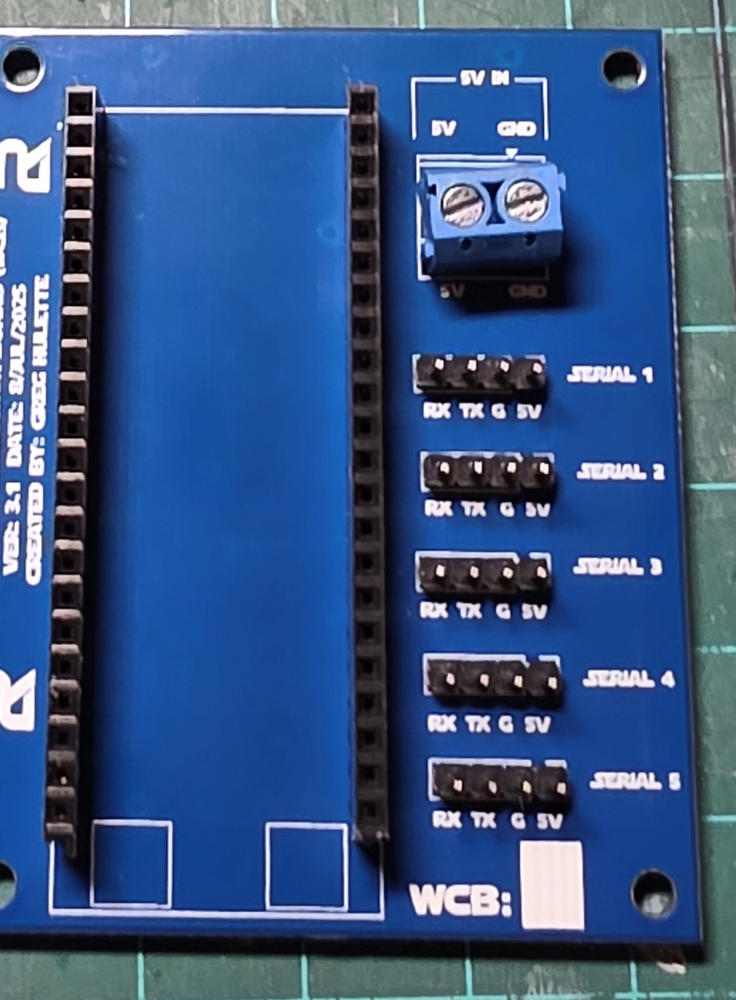

<h1 style="display:inline; height: 75px; font-size:51px;">Build Instructions for WCB V3.1</h1>

## 1.0 Bill of Material ##
### 1.1 - PCB ###
There are two ways to get the PCB, download the code and have a PCB manufacturer, like JLCPCB,PCBWay,OshPark....., or buy them from me with the following link  to the Astromech site where you fan find the [WCB Run](https://astromech.net/forums/showthread.php?44271-Wireless-Communication-Boards-(WCB)-Continuous-23-JAN-2024).  The order form can be found at the bottom of the first post.  

#### 1.1.1 Steps to order from PCB Manufacturer ####

1. Download the GitHub Repository to your computer.
    
2. Navigate to the Folder that the Gerber file is stored by going to  the PCB>Wireless Communication Board (WCB)V3.1> Folder.  The Gerber File is called `WCB_V3.1_Gerber.zip`.  
3. Navigate to the PCB Manufacturer of your choice.  I will go through an example using JLCPCB so some of the steps will be tailored to their ordering system, but most of the ones I've seen are similar.  

4. Drag the gerber file onto the "add gerber file" icon

5. Once you drag the gerber file into the box, it will automatically upload and present you this screen

6. (Optional) Change the color of the PCB to blue.  This normally adds an extra day or two to the processing time, but does not cost more.

7. (Optional) Remove the order number from the PCB.  JLCPCB adds this to all orders and can be removed so you don't have the order number printed on the PCB at a random location.  This used to be a fee to do this, but at least with JLCPCB, they do not charge any longer to remove the order number

8. Save to cart and go through the ordering process.

#### 1.1.2 Steps to order from me ####
1. If you are an Astromech user, please head to the forum post about Wireless Communication Boards and place an order there

### 1.2 ESP32-S3-DEVKITC-1-N8R2 ###

You need one of these per WCB
- (3) ESP32 Boards (Header Pins Unsoldered) ($17.88)- [Amazon - 3 Boards](https://www.amazon.com/ESP32-S3-DevKitC-1-N8R2-Development-ESP32-S3-WROOM-1-Microcontroller-Integrated/dp/B0DFTKFWT2/)
 
Or
 
- (1) ESP32 S3 Board (Header Pins Soldered) ($15) [Amazon 1 board](https://www.amazon.com/Espressif-ESP32-S3-DevKitC-1-N8R8-Development-Board/dp/B09MHP42LY/)  .  It's kind of silly to go with this option when you can get 3 boards for only slightly more than this one, but it's an option.  

### 1.3 Power Terminal Block ###

You need one terminal block per WCB
- 2 Pin Terminal Block (5.08mm pitch)- [Power Terminal Block](https://www.amazon.com/dp/B07CZYGQQ3/)

### 1.4 Male Header Pins ###

You need (5) 1x4 pin headers per WCB

- 2.54mm Pitch Pin Headers 1x4 - [1x4 Pin Header](https://www.amazon.com/MECCANIXITY-Straight-Header-Single-2-54mm/dp/B0C7GMN8CL)
 
or 
 
- 2.54mm Pitch Pin Headers 1x40 - [HiLetgo 20pcs 1x40](https://www.amazon.com/dp/B07R5QDL8D/) 

Either option is valid.  the 1x40 option does break apart very easily to allow you to make the 1x4 header you would need.

### 1.4 Female Header Pins ###

You need (2) 1x22 female pin headers per WCB

- Female Headers (optional but recommended) - [Female PCB Header 1x22](https://www.amazon.com/dp/B0CTKF8V53/)  

This allows you to plug in the ESP32 into the board and replace it easily.  It does add extra height to the WCB, so if that's a concern, you do not need this and can solder the ESP32 directly to the PCB.  

## 2.0 Build

1. Layout the components
     
    
     
2. Start by inserting the female headers into the long rows.
 
    
     
3. Turn over the PCB and solder the top pin on both of the headers.  
 
    
     
4. Straighten out the headers by looking at them from the side angle.  Then touch the soldering iron to the one pad and straighten them both to be vertical.  You can also trying installing the ESP32 into the headers to ensure they are going to be soldered correctly.  
    
5. Once they are straight, continue to solder the rest of the pads
    
6. Place the 4 pin headers in the serial ports
    
7. Tape them down to hold them in place.  
    
8. Turn over and solder 1 pin on each of the headers.
    
9. Straighten each of the headers.
    
10. Once straight, solder the rest of the pads.
    
11. Insert the power terminal block
    
12. Turn over and solder the 2 pins.
    
13. Finished Soldered PCB
    

14. Plug in the ESP32-S3-Devkit with the orientation shown.  The two USB plugs should go over the two boxes on the PCB.
    

 
<b>You have now succesfully created a WCB Version 3.1</b>

To load the sketch, plug the USB micro cable into the port of the left and follow the instruction on the main page.
    

