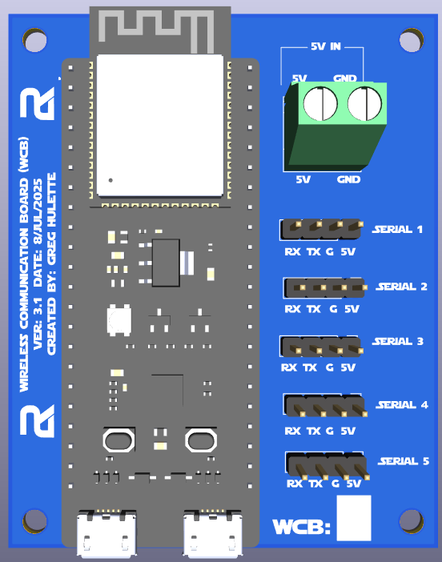
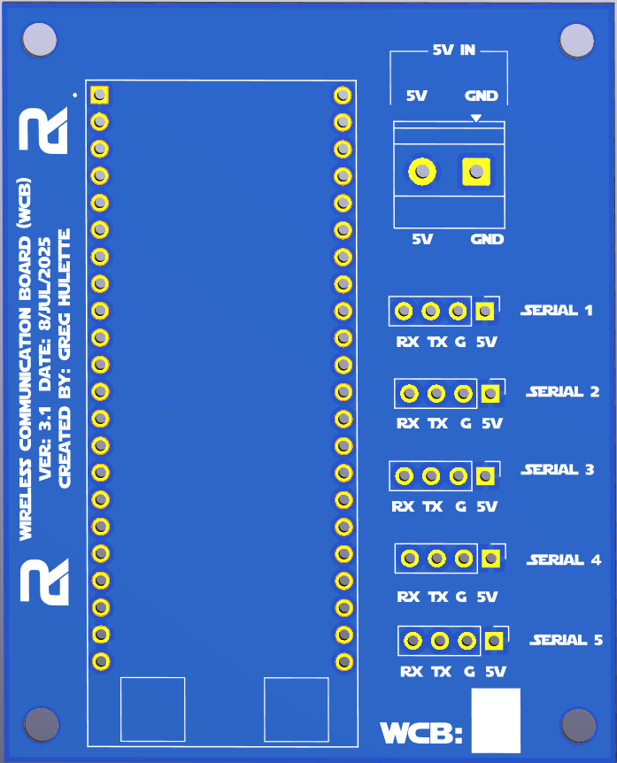
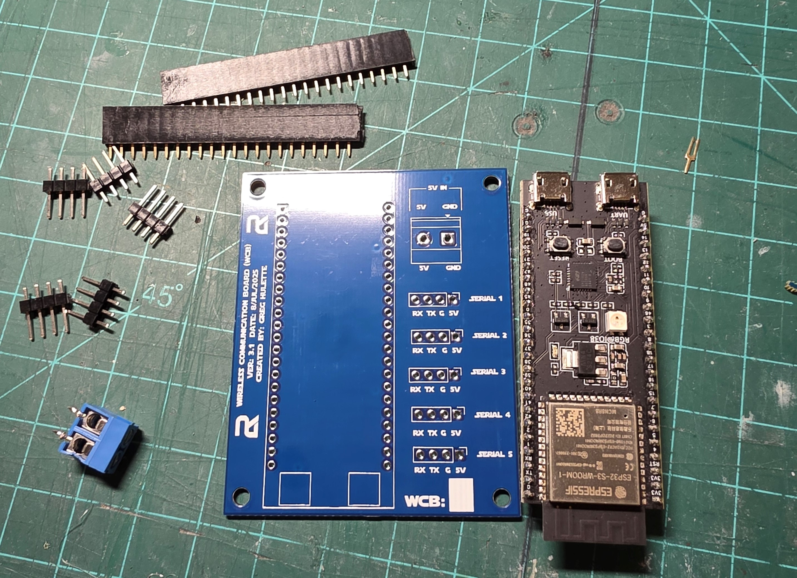
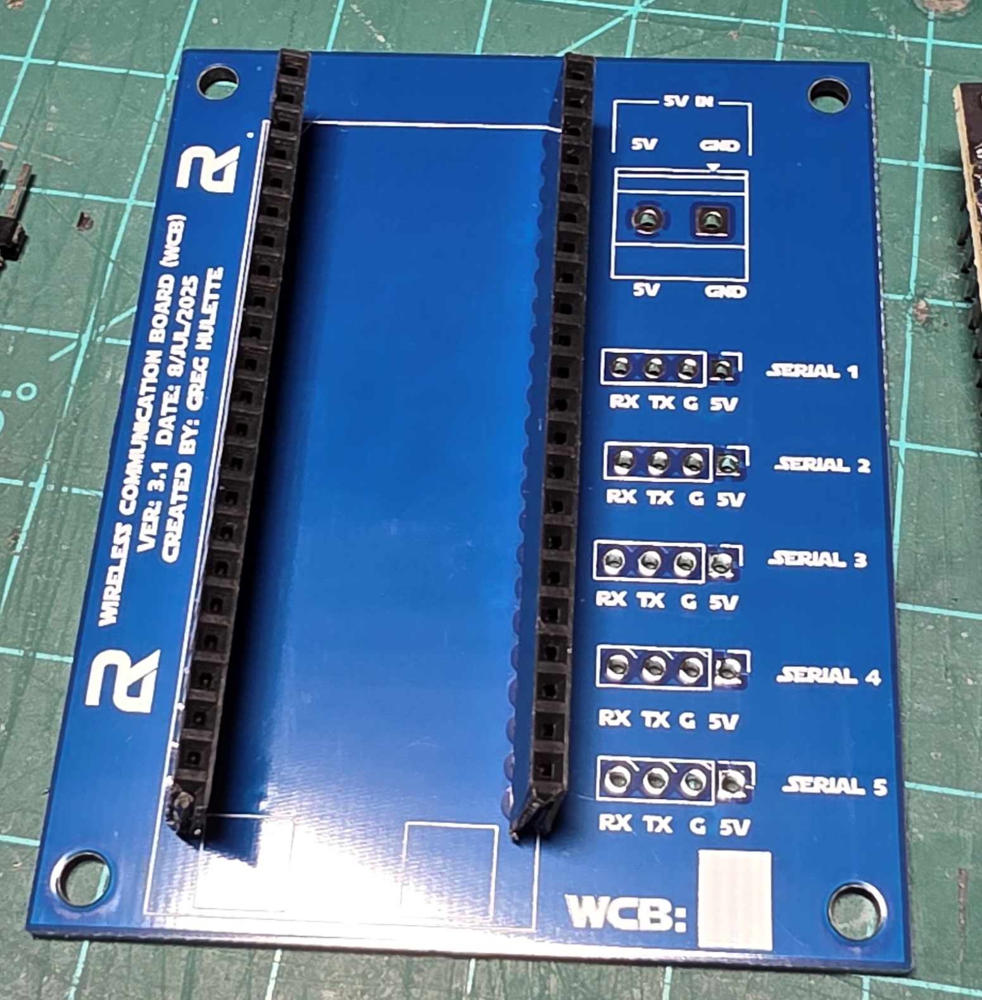

<h1 style="display:inline; height: 75px; font-size:51px;">Wireless Communication Board V3.2 Build Instructions</h1>

## Overview

This document provides comprehensive assembly instructions for the Wireless Communication Board (WCB) Version 3.2. Version 3.2 features an enhanced dual-row header configuration that provides compatibility with multiple ESP32-S3 DevKitC variants, addressing the fit constraints identified in the previous version.

### Version 3.2 Improvements

The primary enhancement in Version 3.2 is the addition of a secondary row of mounting holes, enabling compatibility with both ESP32-S3-DEVKITC-1-N8R8 and ESP32-S3-DEVKITC-1-N16R8 boards. This modification ensures universal fit across ESP32-S3 DevKitC variants.

**Version Comparison**

| V3.1 Populated | V3.2 Populated |
|:-------------:|:--------------:|
|  |  |

| V3.1 Bare PCB | V3.2 Bare PCB |
|:-------------:|:--------------:|
|  |  |

---

## 1.0 Bill of Materials

### 1.1 Printed Circuit Board (PCB)

The PCB can be acquired through two methods:

**Option A: Direct Purchase**
- Available through the Astromech.net forums: [WCB Continuous Run Thread](https://astromech.net/forums/showthread.php?44271-Wireless-Communication-Boards-(WCB)-Continuous-23-JAN-2024)
- Order form located at the bottom of the first post

**Option B: PCB Manufacturing Service**

Follow these steps to order from a PCB manufacturer (JLCPCB, PCBWay, OSH Park, etc.):

#### 1.1.1 PCB Manufacturing Instructions

1. **Download Repository**
   - Navigate to the project GitHub repository
   - Click the green "Code" button and select "Download ZIP"
   
   

2. **Locate Gerber Files**
   - Extract the downloaded repository
   - Navigate to: `PCB > Wireless Communication Board (WCB)V3.1 > Folder`
   - Locate file: `WCB_V3.2_Gerber.zip`

3. **Upload to Manufacturer**
   - Access your preferred PCB manufacturer's website
   - Example shown using JLCPCB
   
   

4. **Upload Gerber File**
   - Drag `WCB_V3.2_Gerber.zip` onto the "Add Gerber File" upload area.  <b>NOTE: Image shows version 3.1, but use version 3.2</B>
   
   

5. **Configure Order**
   - The system will automatically process the file and display the order configuration screen
   
   

6. **PCB Color Selection (Optional)**
   - Select blue PCB color if desired
   - Note: May add 1-2 days to processing time at no additional cost
   
   

7. **Remove Order Number (Optional)**
   - Select "Specify a location" or "Remove order number" option
   - This prevents the manufacturer's order number from appearing on the PCB
   - No additional cost with JLCPCB
   
   

8. **Complete Purchase**
   - Add to cart and proceed through checkout

---

### 1.2 ESP32-S3 Development Board

**Required Quantity:** 1 per WCB

**Compatible Models:**
- ESP32-S3-DEVKITC-1-N8R8
- ESP32-S3-DEVKITC-1-N16R8

**Purchase Options:**

- **Option 1:** 3-pack with unsoldered headers - $18.99  
  [Amazon: ESP32-S3 DevKitC 3-Pack](https://www.amazon.com/ESP32-S3-DevKitC-1-N8R2-Development-ESP32-S3-WROOM-1-Microcontroller-Integrated/dp/B0DKF4DSQ4/?th=1)

- **Option 2:** Single board with pre-soldered headers - $15.00  
  [Amazon: ESP32-S3 DevKitC Single](https://www.amazon.com/Espressif-ESP32-S3-DevKitC-1-N8R8-Development-Board/dp/B09MHP42LY/)

**Recommendation:** Option 1 provides better value and includes spare boards.

---

### 1.3 Power Terminal Block

**Required Quantity:** 1 per WCB

**Specifications:** 2-pin terminal block, 5.08mm pitch

**Source:** [Amazon: 2-Pin Terminal Block](https://www.amazon.com/dp/B07CZYGQQ3/)

---

### 1.4 Male Header Pins

**Required Quantity:** 5 × 1x4 pin headers per WCB

**Specifications:** 2.54mm pitch, straight pin headers

**Purchase Options:**

- **Option 1:** Pre-cut 1x4 headers  
  [Amazon: 1x4 Pin Headers](https://www.amazon.com/MECCANIXITY-Straight-Header-Single-2-54mm/dp/B0C7GMN8CL)

- **Option 2:** 1x40 breakaway headers (20-pack)  
  [Amazon: HiLetgo 1x40 Headers](https://www.amazon.com/dp/B07R5QDL8D/)

**Note:** Option 2 can be easily separated into 1x4 segments as needed.

---

### 1.5 Female Header Sockets

**Required Quantity:** 2 × 1x22 female headers per WCB

**Specifications:** 2.54mm pitch, single-row female headers

**Source:** [Amazon: 1x22 Female Headers](https://www.amazon.com/dp/B0CTKF8V53/)

**Installation Note:** Female headers are optional but strongly recommended. They allow for easy ESP32 installation and removal. However, they do add approximately 8-10mm to the overall board height. If space is constrained, the ESP32 can be soldered directly to the PCB.

---

## 2.0 Assembly Instructions

### 2.1 Component Layout

Before beginning assembly, lay out all components to verify inventory.

---

### 2.2 Female Header Installation

1. **Header Placement**
   - Select the appropriate row of holes based on your ESP32-S3 variant
   - Insert both 1x22 female headers into the long header positions
   - **Note:** Both rows are shown for reference. Install headers in the row that corresponds to your specific ESP32-S3 board.

   

2. **Initial Tack Soldering**
   - Invert the PCB
   - Solder only the topmost pin on each header to temporarily secure them

   

3. **Header Alignment**
   - View the headers from a side angle to check for perpendicularity
   - While reheating the tack-soldered joint, adjust the header to ensure it is perpendicular to the PCB
   - Verify alignment by test-fitting the ESP32 into the headers

   

4. **Complete Soldering**
   - Once alignment is confirmed, solder all remaining pins

   

---

### 2.3 Serial Port Header Installation

1. **Header Insertion**
   - Insert five 1x4 male pin headers into the serial port positions on the PCB

   

2. **Secure Headers**
   - Use tape to hold the headers in position during soldering

   

3. **Initial Tack Soldering**
   - Invert the PCB
   - Solder one pin on each of the five headers

   

4. **Header Alignment**
   - Check each header for perpendicularity
   - Reheat tack joints and adjust as necessary

   

5. **Complete Soldering**
   - Once all headers are properly aligned, solder the remaining pins

   

---

### 2.4 Power Terminal Block Installation

1. **Terminal Block Placement**
   - Insert the 2-pin terminal block into the designated power input position

   

2. **Soldering**
   - Invert the PCB
   - Solder both terminal block pins

   

---

### 2.5 Assembly Completion

**Completed PCB Assembly**

---

### 2.6 ESP32-S3 Installation

1. **Board Orientation**
   - Orient the ESP32-S3 DevKitC board so that both USB ports align with the silkscreen rectangles on the PCB
   - Carefully insert the ESP32 into the female headers

   

2. **Verify Installation**
   - Ensure all pins are properly seated in the headers
   - The ESP32 should sit flush and parallel to the WCB

---

## 3.0 Firmware Installation

### 3.1 USB Connection

Connect a USB cable to the **left-side USB port** of the ESP32-S3 for firmware programming.

### 3.2 Programming Instructions

Refer to the main project documentation for detailed firmware installation procedures and configuration options.

---

## 4.0 Assembly Complete

Your Wireless Communication Board Version 3.2 is now fully assembled and ready for programming.

---

## Revision History

- **V3.2** - Added dual-row header configuration for universal ESP32-S3 DevKitC compatibility
- **V3.1** - Initial production release

---

## Support and Community

For technical support, additional documentation, and community discussions, please visit the Astromech.net forums or join the Discord [here](https://discord.gg/nF2vXW5G9C)